# 🚀 DocuVerse AI × GitHub Automation — Integration Blueprint

> **Goal:** Supercharge DocuVerse from a *read-only analysis tool* into an **active automation engine** that writes back to GitHub — auto-generating docs, issues, PRs, wikis, and CI/CD pipelines directly from its AI analysis.

---

## 📊 Feature Matrix

| # | Feature | Impact | Effort | API Used |
|---|---------|--------|--------|----------|
| 1 | Auto-Push README | 🔥🔥🔥 | Low | Contents API |
| 2 | Auto-Create Issues from Impact Analysis | 🔥🔥🔥 | Medium | Issues API |
| 3 | Auto-Generate GitHub Wiki | 🔥🔥 | Medium | Wiki (Git clone) |
| 4 | Auto-Generate CI/CD Workflows | 🔥🔥🔥 | Medium | Contents API |
| 5 | Auto-Create PR with Docs | 🔥🔥🔥 | Medium | Branches + PR API |
| 6 | Auto-Generate CHANGELOG | 🔥🔥 | Low | Commits API |
| 7 | Auto-Deploy Docs to GitHub Pages | 🔥🔥🔥 | Medium | Pages API |
| 8 | Repo Health Dashboard & Badges | 🔥🔥 | Low | Shields.io + API |
| 9 | Webhook → Auto-Analyze on Push | 🔥🔥🔥 | High | Webhooks API |
| 10 | Auto-Review PRs | 🔥🔥🔥 | High | PR Review API |

---

## 1️⃣ Auto-Push AI-Generated README

**What:** DocuVerse already generates MNC-standard documentation. Push it directly as `README.md` to the repo.

**Flow:**
```
DocuVerse analyzes repo → Generates full docs → User clicks "Push to GitHub"
→ Creates/updates README.md via GitHub Contents API → Commit with message
```

**API:** `PUT /repos/{owner}/{repo}/contents/README.md`

**Value:** One-click professional README for any repo — architecture, dependencies, file-by-file docs, diagrams — all auto-generated.

---

## 2️⃣ Auto-Create Issues from Impact Analysis

**What:** When the Change Impact Simulator finds high-risk files, circular dependencies, or hotspots → auto-create GitHub Issues with labels.

**Flow:**
```
Impact Analysis finds:
  - 3 circular dependencies
  - 2 high-risk hotspot files (risk > 80)
  - 5 files with no tests

→ Auto-creates GitHub Issues:
  🔴 "CRITICAL: Circular dependency between auth.py ↔ users.py"
  🟡 "HIGH RISK: api.ts has 12 dependents — consider splitting"
  🟢 "SUGGESTION: Add tests for payment_handler.py"
```

**API:** `POST /repos/{owner}/{repo}/issues`

**Labels to auto-create:** `docuverse-detected`, `risk:high`, `risk:medium`, `circular-dep`, `needs-tests`, `hotspot`

**Value:** Turns passive analysis into actionable tasks. PMs and tech leads can track code health directly in GitHub.

---

## 3️⃣ Auto-Generate GitHub Wiki

**What:** Push the entire generated documentation as structured Wiki pages — one page per module/file, with cross-links.

**Flow:**
```
DocuVerse generates docs → Clones repo wiki (git) → Creates pages:
  Home.md              → Project overview + architecture diagram
  Module-Auth.md       → Auth system walkthrough
  Module-Database.md   → Database layer docs
  API-Reference.md     → All endpoints documented
  Dependency-Graph.md  → Mermaid dependency diagram
→ Git push to wiki repo
```

**API:** GitHub Wikis use Git (`{repo}.wiki.git`), so clone → add files → push.

**Value:** Full searchable wiki auto-generated. Zero manual writing.

---

## 4️⃣ Auto-Generate CI/CD Workflows

**What:** Analyze the project structure (language, framework, tests, dependencies) and generate a working GitHub Actions `ci.yml`.

**Flow:**
```
DocuVerse detects:
  - Python project (requirements.txt found)
  - pytest in dependencies
  - FastAPI framework
  - ESLint in frontend

→ Generates .github/workflows/ci.yml with:
  - Python setup + pip install
  - pytest runner
  - Lint step
  - Coverage report
→ Pushes via Contents API
```

**API:** `PUT /repos/{owner}/{repo}/contents/.github/workflows/ci.yml`

**Generated Templates:** Python, Node.js, Next.js, FastAPI, Docker, multi-stage pipelines.

**Value:** Instant CI/CD for repos that have zero automation. Huge for hackathon projects and student repos.

---

## 5️⃣ Auto-Create PR with Documentation

**What:** Instead of pushing directly to `main`, create a feature branch with all generated docs and open a Pull Request for review.

**Flow:**
```
User clicks "Create Docs PR" →
  1. Create branch: docs/docuverse-auto-{timestamp}
  2. Add files: README.md, ARCHITECTURE.md, docs/*.md, diagrams
  3. Open PR with title: "📚 DocuVerse: Auto-generated documentation"
  4. PR body contains: summary, file list, preview links
```

**APIs:**
- `POST /repos/{owner}/{repo}/git/refs` (create branch)
- `PUT /repos/{owner}/{repo}/contents/{path}` (add files)
- `POST /repos/{owner}/{repo}/pulls` (open PR)

**Value:** Non-destructive. Team can review AI-generated docs before merging. Professional workflow.

---

## 6️⃣ Auto-Generate CHANGELOG

**What:** Read commit history → use AI to group commits by category → generate a clean `CHANGELOG.md`.

**Flow:**
```
GET /repos/{owner}/{repo}/commits (last 100)
→ AI categorizes: Features, Fixes, Refactors, Docs
→ Generates CHANGELOG.md with semantic grouping
→ Push to repo
```

**API:** `GET /repos/{owner}/{repo}/commits`

**Example Output:**
```markdown
## [Unreleased] - 2026-03-04
### ✨ Features
- Added user authentication via OAuth (#23)
- Implemented file upload endpoint (#28)
### 🐛 Fixes
- Fixed memory leak in parser (#31)
### 🔧 Refactors
- Extracted validation logic into middleware (#29)
```

---

## 7️⃣ Auto-Deploy Docs to GitHub Pages

**What:** Generate a beautiful static documentation site and deploy it to GitHub Pages automatically.

**Flow:**
```
DocuVerse generates docs → Builds static HTML site (Next.js export or MkDocs)
→ Pushes to gh-pages branch → Enables GitHub Pages
→ Live at: https://{user}.github.io/{repo}/
```

**APIs:**
- `POST /repos/{owner}/{repo}/pages` (enable Pages)
- Contents API to push built files to `gh-pages` branch

**Value:** One-click documentation website. Looks like Stripe/Vercel docs but auto-generated.

---

## 8️⃣ Repo Health Dashboard & Badges

**What:** Generate dynamic repo health badges based on DocuVerse analysis.

**Badges to generate:**
```markdown


```

**Flow:** Analyze repo → compute metrics → inject badge URLs into README → push.

---

## 9️⃣ Webhook → Auto-Analyze on Push

**What:** Register a GitHub webhook so that every `git push` automatically triggers a DocuVerse re-analysis.

**Flow:**
```
Developer pushes code → GitHub fires webhook → DocuVerse server receives it
→ Re-indexes changed files → Updates docs, impact scores, walkthroughs
→ Posts results as PR comment or commit status check
```

**API:** `POST /repos/{owner}/{repo}/hooks`

**Value:** Documentation is ALWAYS up-to-date. Never stale again.

---

## 🔟 Auto-Review PRs with AI Analysis

**What:** When a PR is opened, DocuVerse analyzes the changed files and posts an automated review.

**Flow:**
```
PR opened → Webhook triggers → DocuVerse:
  1. Reads changed files (GET /pulls/{num}/files)
  2. Runs impact analysis on each changed file
  3. Generates AI review comments
  4. Posts review via PR Review API

PR Comment:
  "🔍 DocuVerse Impact Report:
   - auth.py: Risk Score 72 (HIGH) — 8 files depend on this
   - utils.py: Risk Score 15 (LOW) — isolated utility
   - ⚠️ Circular dependency detected: auth.py ↔ middleware.py
   Recommendation: Add tests for auth.py before merging."
```

**API:** `POST /repos/{owner}/{repo}/pulls/{num}/reviews`

---

## 🏗️ Implementation Priority

### Phase 1 — Quick Wins (1-2 days)
- [x] Create repo / Delete repo (already done in GitWake)
- [ ] **Auto-Push README** — highest impact, lowest effort
- [ ] **Auto-Generate CHANGELOG** — read commits + AI summarize
- [ ] **Repo Health Badges** — compute metrics + inject into README

### Phase 2 — Core Power (3-5 days)
- [ ] **Auto-Create Issues from Impact Analysis** — actionable intelligence
- [ ] **Auto-Create PR with Docs** — professional workflow
- [ ] **Auto-Generate CI/CD Workflows** — instant DevOps

### Phase 3 — Next Level (1-2 weeks)
- [ ] **Auto-Deploy to GitHub Pages** — live documentation site
- [ ] **Auto-Generate Wiki** — full searchable documentation
- [ ] **Webhook Auto-Analyze** — always up-to-date
- [ ] **Auto-Review PRs** — AI code reviewer

---

## 🔌 Integration Architecture

```
┌──────────────────────────────────────────────────────────────────┐
│                      DOCUVERSE AI ENGINE                         │
│                                                                  │
│  ┌──────────┐   ┌──────────┐   ┌──────────┐   ┌──────────────┐ │
│  │ Doc Gen  │   │ Impact   │   │ Diagram  │   │ Walkthrough  │ │
│  │ Engine   │   │ Analyzer │   │ Engine   │   │ Generator    │ │
│  └────┬─────┘   └────┬─────┘   └────┬─────┘   └──────┬───────┘ │
│       │              │              │                 │         │
│       └──────────────┼──────────────┼─────────────────┘         │
│                      │                                          │
│              ┌───────▼────────┐                                 │
│              │  GitHub        │                                 │
│              │  Automation    │                                 │
│              │  Layer (NEW)   │                                 │
│              └───────┬────────┘                                 │
└──────────────────────┼──────────────────────────────────────────┘
                       │
          ┌────────────┼────────────┐
          │            │            │
          ▼            ▼            ▼
   ┌───────────┐ ┌──────────┐ ┌──────────┐
   │ Contents  │ │ Issues   │ │ PR       │
   │ API       │ │ API      │ │ API      │
   │           │ │          │ │          │
   │ README.md │ │ Auto-    │ │ Docs PR  │
   │ CI/CD     │ │ issues   │ │ Review   │
   │ CHANGELOG │ │ Labels   │ │ Comments │
   │ Wiki      │ │ Assign   │ │          │
   └───────────┘ └──────────┘ └──────────┘
```

---

## 💎 Killer Combo: The "One-Click Repo Upgrade"

Imagine a single button in DocuVerse:

> **⚡ Upgrade This Repo**

That triggers ALL of these in sequence:
1. Generates professional README with architecture diagrams
2. Creates CHANGELOG from commit history
3. Adds CI/CD workflow for the detected stack
4. Creates issues for all detected code health problems
5. Opens a single PR with everything
6. Adds health badges to README

**Result:** Any repo goes from zero to production-grade documentation and DevOps in 30 seconds.

### Visual: One-Click Upgrade Pipeline

```mermaid
flowchart TD
    BTN["⚡ User Clicks: Upgrade This Repo"]
    BTN --> CLONE["📥 Clone Repository"]

    CLONE --> PARALLEL{"Run All Engines in Parallel"}

    PARALLEL --> DOC["📝 Doc Generator"]
    PARALLEL --> IMPACT["🔬 Impact Analyzer"]
    PARALLEL --> DIAGRAM["📊 Diagram Engine"]
    PARALLEL --> COMMITS["📜 Commit History Reader"]
    PARALLEL --> STACK["🛠️ Stack Detector"]

    DOC --> README["README.md\n• Overview\n• Architecture\n• File-by-file docs\n• API reference"]
    IMPACT --> ISSUES["GitHub Issues\n🔴 Circular deps\n🟡 High-risk hotspots\n🟢 Missing tests"]
    IMPACT --> BADGES["Health Badges\n• Code Health: 87%\n• Risk: Low\n• Circular Deps: 0"]
    DIAGRAM --> MERMAID["Architecture Diagrams\n• Dependency graph\n• Class diagram\n• Data flow"]
    COMMITS --> CHANGELOG["CHANGELOG.md\n• Features\n• Fixes\n• Refactors"]
    STACK --> CICD[".github/workflows/ci.yml\n• Build\n• Test\n• Lint\n• Deploy"]

    README --> BRANCH["🌿 Create Branch\ndocs/docuverse-upgrade"]
    ISSUES --> GHISSUES["📌 POST /repos/.../issues\nAuto-labeled & assigned"]
    BADGES --> README
    MERMAID --> README
    CHANGELOG --> BRANCH
    CICD --> BRANCH

    BRANCH --> PR["🔀 Open Pull Request\n📚 DocuVerse: Complete Repo Upgrade\n• README.md\n• CHANGELOG.md\n• CI/CD workflow\n• Architecture diagrams"]

    PR --> DONE["✅ Done in ~30 seconds\nRepo is production-grade"]

    style BTN fill:#7c3aed,stroke:#a78bfa,stroke-width:3px,color:#fff
    style PARALLEL fill:#1e1e2e,stroke:#58a6ff,stroke-width:2px,color:#fff
    style DONE fill:#22c55e,stroke:#4ade80,stroke-width:3px,color:#fff
    style PR fill:#2563eb,stroke:#60a5fa,stroke-width:2px,color:#fff
    style GHISSUES fill:#ef4444,stroke:#f87171,stroke-width:2px,color:#fff
    style README fill:#0d1117,stroke:#3fb950,color:#e6edf3
    style CHANGELOG fill:#0d1117,stroke:#3fb950,color:#e6edf3
    style CICD fill:#0d1117,stroke:#3fb950,color:#e6edf3
    style ISSUES fill:#0d1117,stroke:#f97316,color:#e6edf3
    style BADGES fill:#0d1117,stroke:#eab308,color:#e6edf3
    style MERMAID fill:#0d1117,stroke:#a78bfa,color:#e6edf3
```



### Sequence: What Happens Under the Hood

```mermaid
sequenceDiagram
    actor User
    participant UI as DocuVerse UI
    participant API as FastAPI Backend
    participant AI as GPT-4o Engine
    participant TS as Tree-sitter
    participant NX as networkx DAG
    participant GH as GitHub API

    User->>UI: Click "⚡ Upgrade This Repo"
    UI->>API: POST /upgrade/one-click

    rect rgb(30, 30, 46)
        Note over API: Phase 1 — Analyze (parallel)
        par Analyze Code
            API->>TS: Parse all files → AST
            TS-->>API: Functions, classes, imports
        and Build Graph
            API->>NX: Build dependency DAG
            NX-->>API: Risk scores, hotspots, cycles
        and Read Commits
            API->>GH: GET /repos/.../commits
            GH-->>API: Last 100 commits
        and Detect Stack
            API->>API: Scan package.json, requirements.txt
        end
    end

    rect rgb(30, 30, 46)
        Note over API: Phase 2 — Generate (parallel)
        par Generate README
            API->>AI: AST + context → README.md
            AI-->>API: Professional README
        and Generate CHANGELOG
            API->>AI: Commits → categorized CHANGELOG
            AI-->>API: CHANGELOG.md
        and Generate CI/CD
            API->>AI: Stack info → GitHub Actions YAML
            AI-->>API: ci.yml workflow
        and Generate Diagrams
            API->>AI: AST → Mermaid diagrams
            AI-->>API: Architecture + dependency diagrams
        end
    end

    rect rgb(30, 30, 46)
        Note over API: Phase 3 — Push to GitHub
        API->>GH: Create branch "docs/docuverse-upgrade"
        GH-->>API: Branch created

        par Push Files
            API->>GH: PUT README.md
            API->>GH: PUT CHANGELOG.md
            API->>GH: PUT .github/workflows/ci.yml
            API->>GH: PUT docs/architecture.md
        and Create Issues
            API->>GH: POST /issues (circular deps)
            API->>GH: POST /issues (high-risk files)
            API->>GH: POST /issues (missing tests)
        end

        API->>GH: POST /pulls (open PR)
        GH-->>API: PR #42 created
    end

    API-->>UI: ✅ Upgrade complete!
    UI-->>User: "PR #42 opened with 6 files + 3 issues created"
```



---

